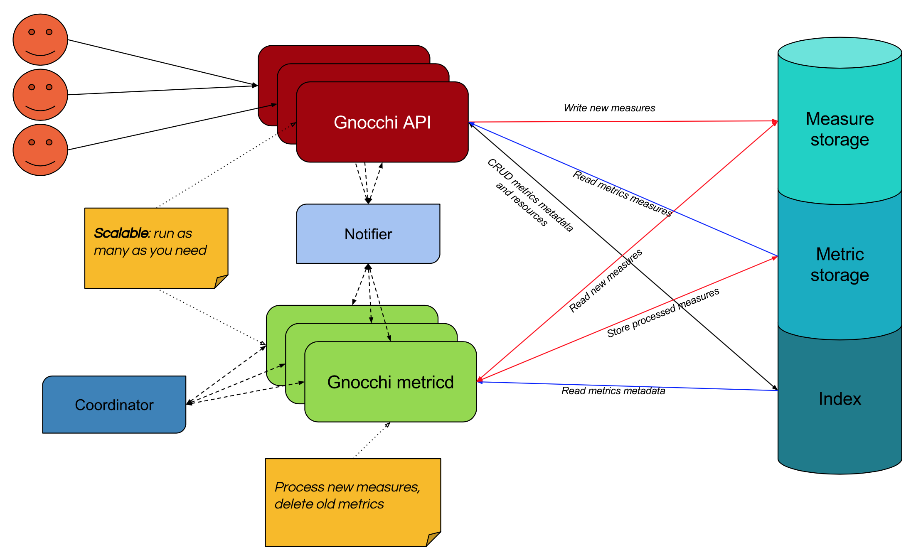

======================
 Project Architecture
======================

Gnocchi consists of several services: a HTTP REST API (see :doc:`rest`), an
optional statsd-compatible daemon (see :doc:`statsd`), and an asynchronous
processing daemon (named `gnocchi-metricd`). Data is received via the HTTP REST
API or statsd daemon. `gnocchi-metricd` performs operations (statistics
computing, metric cleanup, etc...) on the received data in the background.

Both the HTTP REST API and the asynchronous processing daemon are stateless and
are scalable. Additional workers can be added depending on load.

Back-ends
---------

Gnocchi uses three different back-ends for storing data: one for storing new
incoming measures (the incoming driver), one for storing the time series (the
storage driver) and one for indexing the data (the index driver).

The *incoming* storage is responsible for storing new measures sent to metrics.
It is by default – and usually – the same driver as the *storage* one.

The *storage* is responsible for storing measures of created metrics. It
receives timestamps and values, and pre-computes aggregations according to the
defined archive policies.

The *indexer* is responsible for storing the index of all resources, archive
policies and metrics, along with their definitions, types and properties. The
indexer is also responsible for linking resources with metrics.

Available storage back-ends
~~~~~~~~~~~~~~~~~~~~~~~~~~~

Gnocchi currently offers different storage drivers:

* File (default)
* `Ceph`_ (preferred)
* `OpenStack Swift`_
* `S3`_

The drivers are based on an intermediate library, named *Carbonara*, which
handles the time series manipulation, since none of these storage technologies
handle time series natively.

The four *Carbonara* based drivers are working well and are as scalable as
their back-end technology permits. Ceph and Swift are inherently more scalable
than the file driver.

Depending on the size of your architecture, using the file driver and storing
your data on a disk might be enough. If you need to scale the number of server
with the file driver, you can export and share the data via NFS among all
Gnocchi processes. In any case, it is obvious that S3, Ceph and Swift drivers
are largely more scalable. Ceph also offers better consistency, and hence is
the recommended driver.

.. _OpenStack Swift: http://docs.openstack.org/developer/swift/
.. _Ceph: https://ceph.com
.. _`S3`: https://aws.amazon.com/s3/

Available index back-ends
~~~~~~~~~~~~~~~~~~~~~~~~~

Gnocchi currently offers different index drivers:

* `PostgreSQL`_ (preferred)
* `MySQL`_ (at least version 5.6.4)

Those drivers offer almost the same performance and features, though PostgreSQL
tends to be more performant and has some additional features (e.g. resource
duration computing).

.. _PostgreSQL: http://postgresql.org
.. _MySQL: http://mysql.org

How to plan for Gnocchi’s storage
---------------------------------

Gnocchi uses a custom file format based on its library *Carbonara*. In Gnocchi,
a time series is a collection of points, where a point is a given measure, or
sample, in the lifespan of a time series. The storage format is compressed
using various techniques, therefore the computing of a time series' size can be
estimated based on its **worst** case scenario with the following formula::

    number of points × 8 bytes = size in bytes

The number of points you want to keep is usually determined by the following
formula::

    number of points = timespan ÷ granularity

For example, if you want to keep a year of data with a one minute resolution::

    number of points = (365 days × 24 hours × 60 minutes) ÷ 1 minute
    number of points = 525 600

Then::

    size in bytes = 525 600 bytes × 6 = 3 159 600 bytes = 3 085 KiB

This is just for a single aggregated time series. If your archive policy uses
the 6 default aggregation methods (mean, min, max, sum, std, count) with the
same "one year, one minute aggregations" resolution, the space used will go up
to a maximum of 6 × 4.1 MiB = 24.6 MiB.
