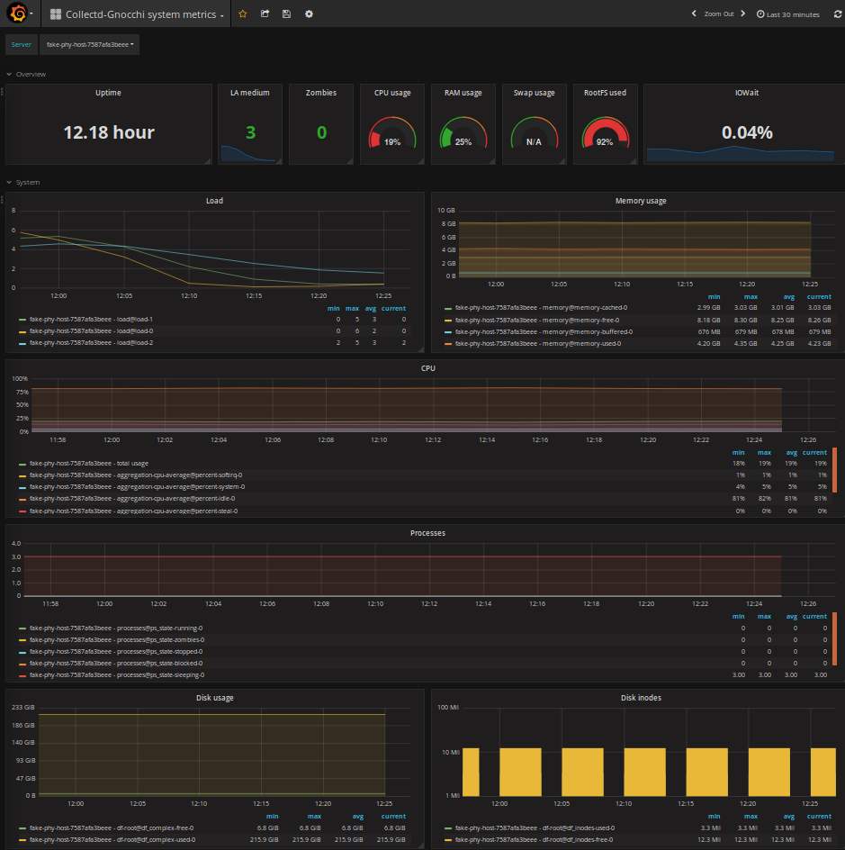

=================
Grafana support
=================

`Grafana`_ has support for Gnocchi through a plugin. It can be installed with
grafana-cli::

     sudo grafana-cli plugins install gnocchixyz-gnocchi-datasource

`Source`_ and `Documentation`_ are also available.

Grafana has 2 modes of operation: proxy or direct mode. In proxy mode, your
browser only communicates with Grafana, and Grafana communicates with Gnocchi.
In direct mode, your browser communicates with Grafana, Gnocchi, and possibly
Keystone.

Picking the right mode depends if your Gnocchi server is reachable by your
browser and/or by your Grafana server.

In order to use Gnocchi with Grafana in proxy mode, you just need to:

1. Install Grafana and its Gnocchi plugin
2. Configure a new datasource in Grafana with the Gnocchi URL.
   If you are using the Keystone middleware for authentication, you can also
   provide an authentication token.

In order to use Gnocchi with Grafana in direct mode, you need to do a few more
steps:

1. Configure the CORS middleware in `gnocchi.conf` to allow request from
   Grafana::

     [cors]
     allowed_origin = http://grafana.fqdn

2. Configure the CORS middleware in Keystone to allow request from Grafana too::

     [cors]
     allowed_origin = http://grafana.fqdn

3. Configure a new datasource in Grafana with the Keystone URL, a user, a
   project and a password. Your browser will query Keystone for a token, and
   then query Gnocchi based on what Grafana needs.

.. note::

    `allowed_origin` format is format: `<protocol>://<host>[:<port>]`. No path,
    no query string and no trailing `/`.

.. _`Grafana`: http://grafana.org
.. _`Documentation`: https://grafana.net/plugins/gnocchixyz-gnocchi-datasource
.. _`Source`: https://github.com/gnocchixyz/grafana-gnocchi-datasource
.. _`CORS`: https://en.wikipedia.org/wiki/Cross-origin_resource_sharing
