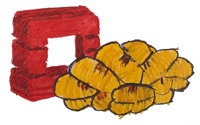

==================================
Gnocchi – Metric as a Service
==================================

.. include:: ../../README.rst
   :start-line: 6

Why Gnocchi?
------------

Gnocchi has been created to fulfill the need of a time series database usable
in the context of cloud computing: providing the ability to store large
quantities of metrics and being easily scalable.

The Gnocchi project was started in 2014 as a spin-off of the `OpenStack
Ceilometer`_ project to address the performance issues that Ceilometer
encountered while using standard databases as a storage backends for metrics.
More information are available on `Julien's blog post on Gnocchi
<https://julien.danjou.info/blog/2014/openstack-ceilometer-the-gnocchi-experiment>`_.

.. _`OpenStack Ceilometer`: http://launchpad.net/ceilometer

Use cases
---------
Gnocchi is meant to be used to store time series and their associated resource
metadata. It’s therefore useful for example as:

- Storage brick for a billing system
- Alarm-triggering or monitoring system
- Statistical usage of data

Key Features
------------

- HTTP REST interface
- Horizontal scalability
- Metric aggregation
- Measures batching support
- Archiving policy
- Metric value search
- Structured resources
- Resource history
- Queryable resource indexer
- Multi-tenant
- Grafana support
- Statsd protocol support

Documentation
-------------

.. toctree::
   :maxdepth: 1

   architecture
   install
   configuration
   running
   client
   rest
   statsd
   grafana
   glossary
   releasenotes/index.rst

.. _`OpenStack`: http://openstack.org
