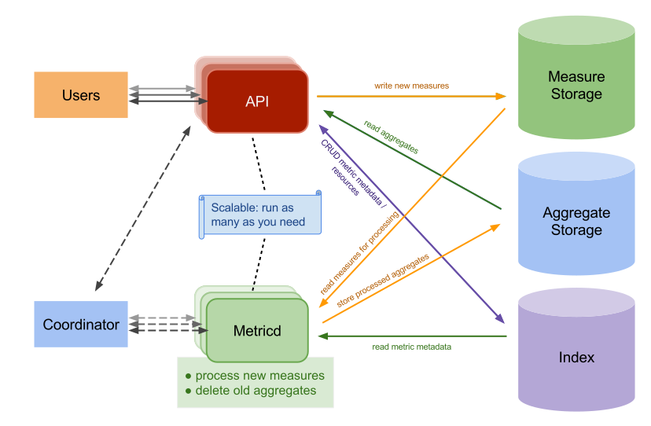

Getting started
---------------

Architecture overview
~~~~~~~~~~~~~~~~~~~~~

Gnocchi consists of several services: a HTTP REST API (see :doc:`rest`), an
optional statsd-compatible daemon (see :doc:`statsd`), and an asynchronous
processing daemon (named `gnocchi-metricd`). Data is received via the HTTP REST
API or statsd daemon. `gnocchi-metricd` performs operations (statistics
computing, |metric| cleanup, etc...) on the received data in the background.

.. image source: https://docs.google.com/drawings/d/1aHV86TPNFt7FlCLEjsTvV9FWoFYxXCaQOzfg7NdXVwM/edit?usp=sharing

All those services are stateless and therefore horizontally scalable. Contrary
to many time series databases, there is no limit on the number of
`gnocchi-metricd` daemons or `gnocchi-api` endpoints that you can run. If your
load starts to increase, you just need to spawn more daemons to handle the flow
of new requests. The same applies if you want to handle high-availability
scenarios: just start more Gnocchi daemons on independent servers.

As you can see on the architecture diagram above, there are three external
components that Gnocchi needs to work correctly:

- An incoming measure storage
- An aggregated metric storage
- An index

Those three parts are provided by drivers. Gnocchi is entirely pluggable and
offer different options for those services.

Incoming and storage drivers
++++++++++++++++++++++++++++

Gnocchi can leverage different storage systems for its incoming |measures| and
aggregated |metrics|, such as:

* File (default)
* `Ceph`_ (preferred)
* `OpenStack Swift`_
* `Amazon S3`_
* `Redis`_

Depending on the size of your architecture, using the file driver and storing
your data on a disk might be enough. If you need to scale the number of server
with the file driver, you can export and share the data via NFS among all
Gnocchi processes. Ultimately, the S3, Ceph, and Swift drivers are more
scalable storage options. Ceph also offers better consistency, and hence is the
recommended driver.

A typical recommendation for medium to large scale deployment is to use
`Redis`_ as an incoming measure storage and `Ceph`_ as an aggregate storage.

.. _`OpenStack Swift`: http://docs.openstack.org/developer/swift/
.. _`Ceph`: https://ceph.com
.. _`Amazon S3`: https://aws.amazon.com/s3/
.. _`Redis`: https://redis.io

Indexer driver
++++++++++++++

You also need a database to index the resources and metrics that Gnocchi will
handle. The supported drivers are:

* `PostgreSQL`_ (preferred)
* `MySQL`_ (at least version 5.6.4)

The *indexer* is responsible for storing the index of all |resources|, |archive
policies| and |metrics|, along with their definitions, types and properties.
The indexer is also responsible for linking |resources| with |metrics| and the
relationships of |resources|..

.. _PostgreSQL: http://postgresql.org
.. _MySQL: http://mysql.org

Understanding aggregation
~~~~~~~~~~~~~~~~~~~~~~~~~

The way data points are aggregated is configurable on a per-metric basis, using
an archive policy.

An archive policy defines which aggregations to compute and how many aggregates
to keep. Gnocchi supports a variety of aggregation methods, such as minimum,
maximum, average, Nth percentile, standard deviation, etc. Those aggregations
are computed over a period of time (called granularity) and are kept for a
defined timespan.

Gnocchi uses three different back-ends for storing data: one for storing new
incoming |measures| (the *incoming* driver), one for storing the |time series|
|aggregates| (the *storage* driver) and one for indexing the data (the *index*
driver). By default, the *incoming* driver is configured to use the same value
as the *storage* driver.

.. include:: include/term-substitution.rst
